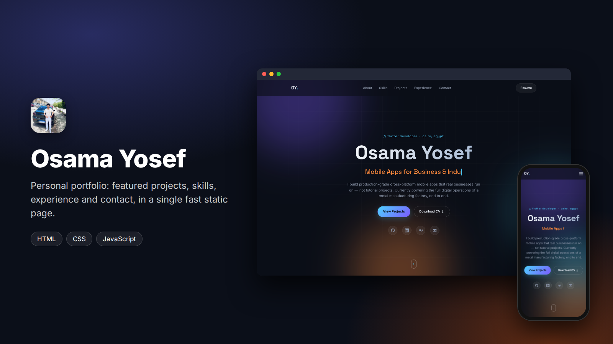
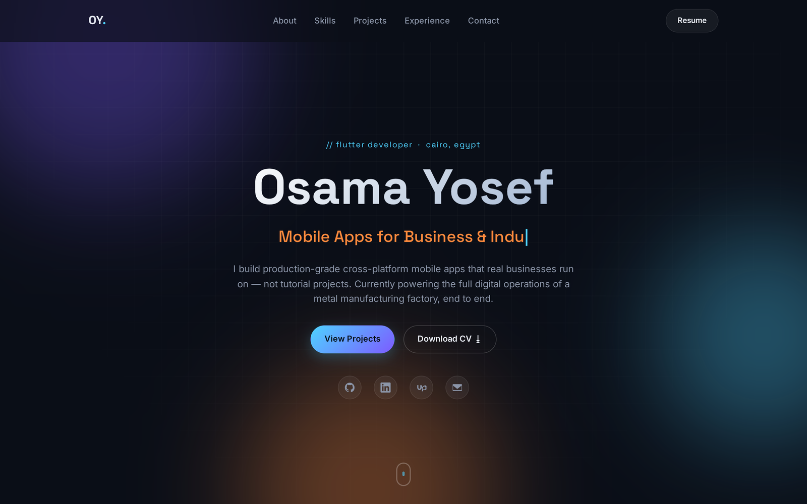
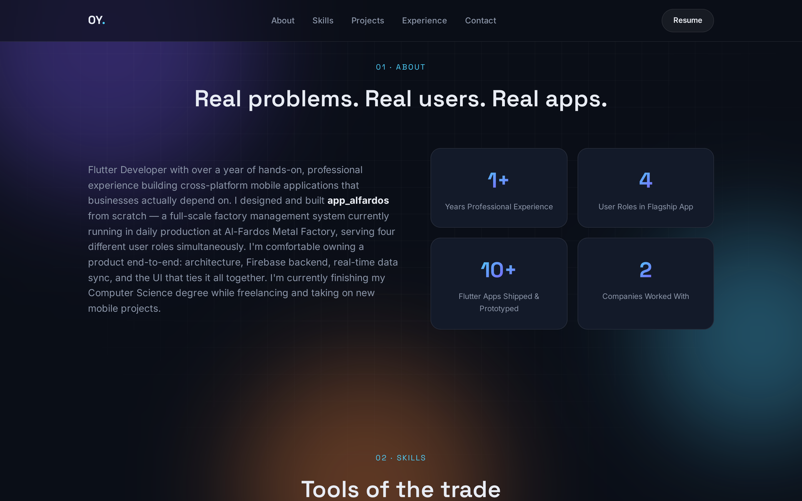
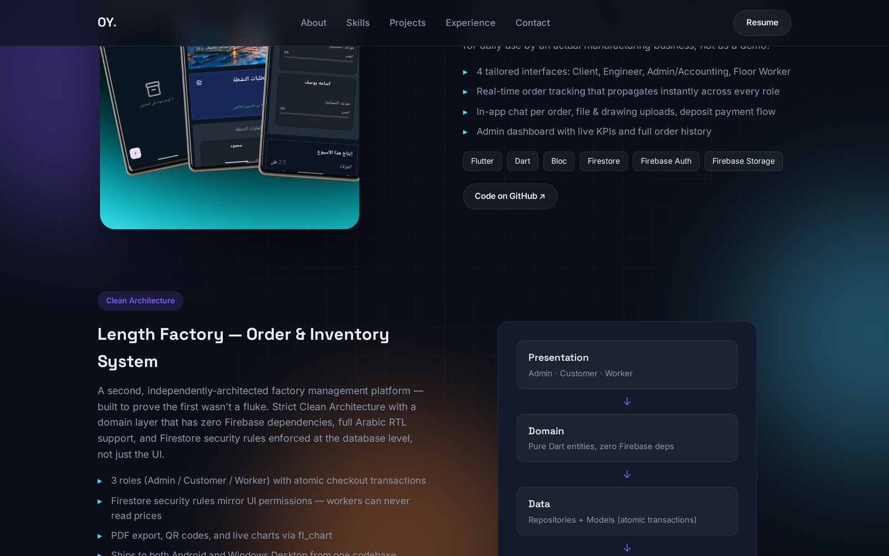
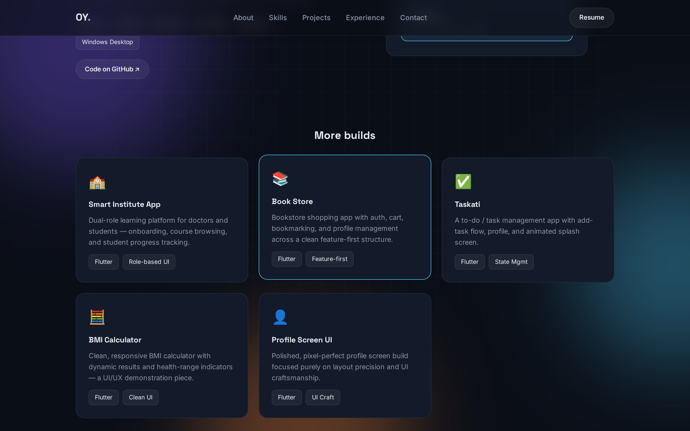
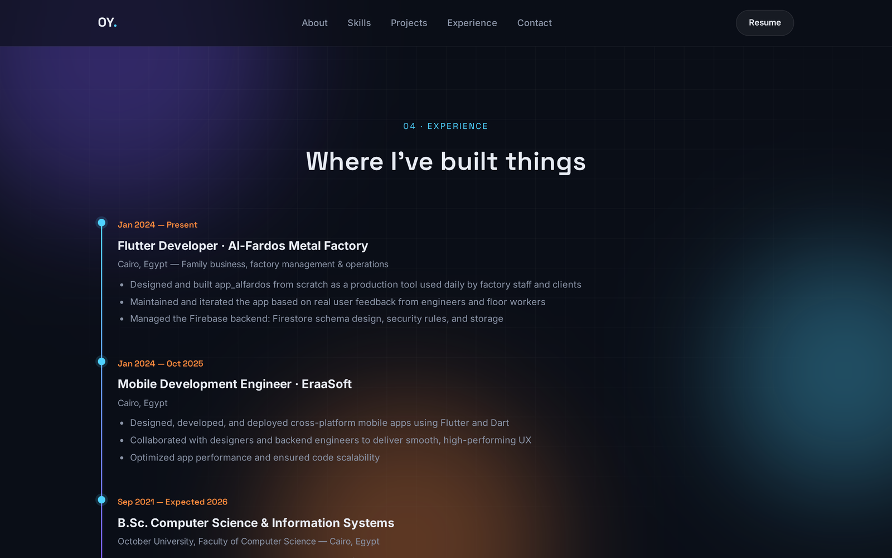
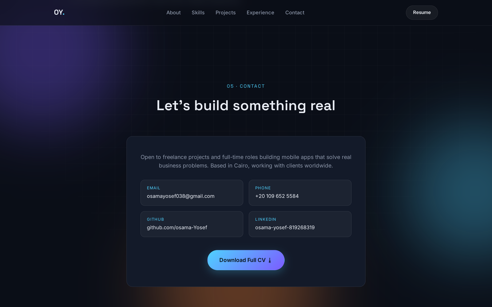
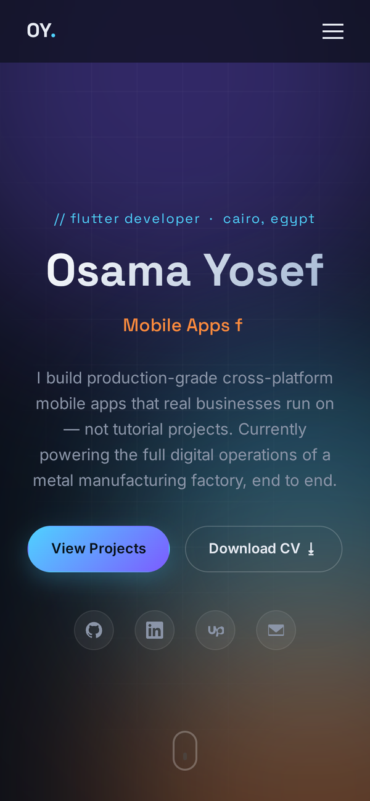

<div align="center">



<br/>

[](index.html)
[](style.css)
[](script.js)
[](#run-locally)

**My personal portfolio website.**
Featured projects, skills, experience and contact details on one fast, responsive page
with no framework and no build step.

</div>

---

## Screenshots



<table>
  <tr>
    <td width="50%"><br/><sub><b>About</b> · summary and key numbers</sub></td>
    <td width="50%"><br/><sub><b>Featured work</b> · case studies with highlights and tech</sub></td>
  </tr>
  <tr>
    <td width="50%"><br/><sub><b>More builds</b> · smaller apps linked to their repositories</sub></td>
    <td width="50%"><br/><sub><b>Experience</b> · timeline of roles and education</sub></td>
  </tr>
  <tr>
    <td width="50%"><br/><sub><b>Contact</b> · email, phone, GitHub, LinkedIn and CV download</sub></td>
    <td width="50%" align="center"><br/><sub><b>Mobile</b> · responsive layout with a menu drawer</sub></td>
  </tr>
</table>

## Sections

| Section | Content |
|:--|:--|
| **Hero** | name, role, typing headline, CV download and social links |
| **About** | short introduction and key numbers |
| **Skills** | mobile, backend and cloud, tools, practices |
| **Featured work** | project case studies with highlights, a screenshot gallery and GitHub links |
| **More builds** | cards for smaller projects |
| **Experience** | work history and education timeline |
| **Contact** | email, phone, GitHub, LinkedIn and full CV |

## Details

- Plain HTML, CSS and JavaScript, no dependencies
- Dark design with soft gradient lights and a subtle grid
- Scroll-reveal animations, a typing effect in the hero and an auto-rotating screenshot gallery
- Sticky navigation that turns into a drawer on small screens
- CV available as a downloadable file in `assets/docs`

```
index.html      page structure and content
style.css       layout, theme and animations
script.js       typing effect, gallery, reveal on scroll, mobile menu
assets/
  screenshots/  project images used on the page
  docs/         CV
```

## Run locally

Open `index.html` in a browser, or serve the folder:

```bash
npx serve .
```

## Contact

**Osama Yosef** · Flutter developer, Cairo

[](https://github.com/osama-Yosef)
[](https://www.linkedin.com/in/osama-yosef-819268319)
[](https://upwork.com/freelancers/~014ebd205ef38ca04c)
[](mailto:osamayosef038@gmail.com)
